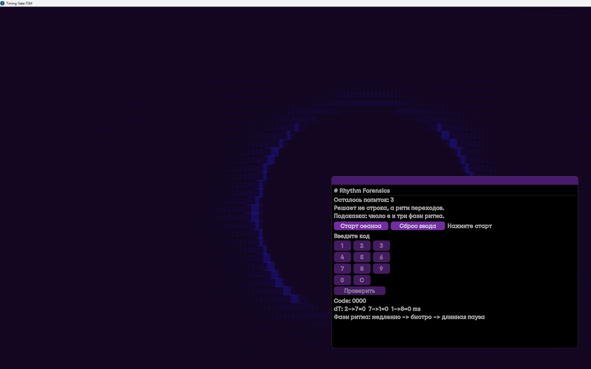
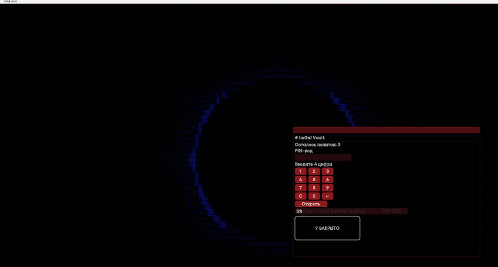
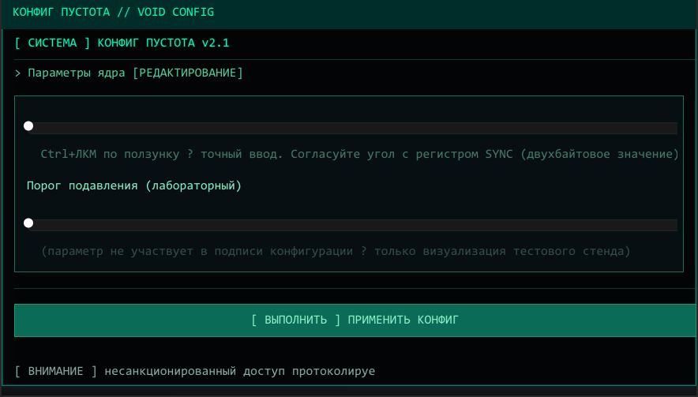

# Задания anti-CTF

Три таска под Windows: **Timing Gate**, **ImGui Vault** и **VOID CONFIG** (3-е задание).

### Скриншоты

  
*Timing Gate (`timing_gate.exe`) — Task 1*

  
*ImGui Vault (`vault_fresh.exe`) — Task 2*

  
*VOID CONFIG (`eclipse_config.exe`) — Task 3*

Ссылки:
- Условия для людей, которые решают: [CTF_TASK_STATEMENTS.md](CTF_TASK_STATEMENTS.md)
- Короткая версия под Word: [ANTIctf.md](ANTIctf.md)
- **Райтапы** (подробный разбор): [WRITEUPS.md](WRITEUPS.md)
- **Флаги + при каких событиях какой:** [FLAGS.md](FLAGS.md)
- Коротко для препода: [TEACHER_VERIFICATION.md](TEACHER_VERIFICATION.md)
- Что сдавал и зачем: [ANTI_CTF_SUBMISSION.md](ANTI_CTF_SUBMISSION.md)
- Готовые zip с exe: папка [Deliverables/](Deliverables/)

Код:
- `Source/ImGuiVaultFresh/` — сейф
- `Source/TimingGateFSM/` — тайминг-таск
- `Source/EclipseConfig/` — упрощённый кроссплатформенный вариант 3-го задания
- `Task-03-VOID-CONFIG/` — основной DirectX 11 вариант 3-го задания
- `Source/SharedAssets/` — шрифт, фон, rc для вшивания в exe

Deliverables:
- `Deliverables/ImGuiVaultFresh_windows.zip`
- `Deliverables/RhythmForensics_windows.zip`
- `Deliverables/VOID_CONFIG_windows.zip`
